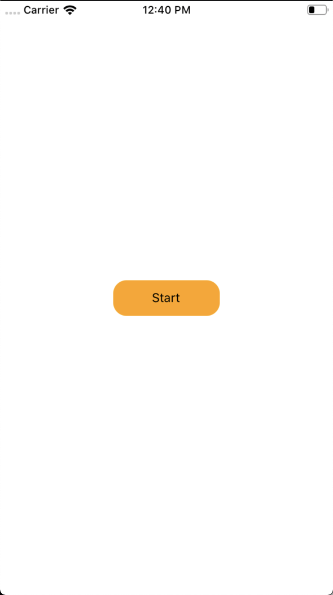
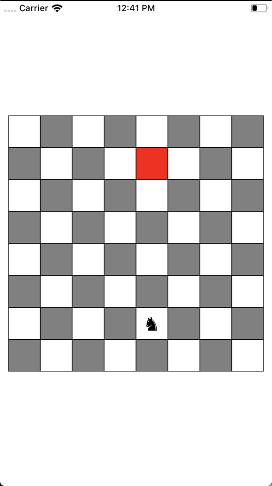
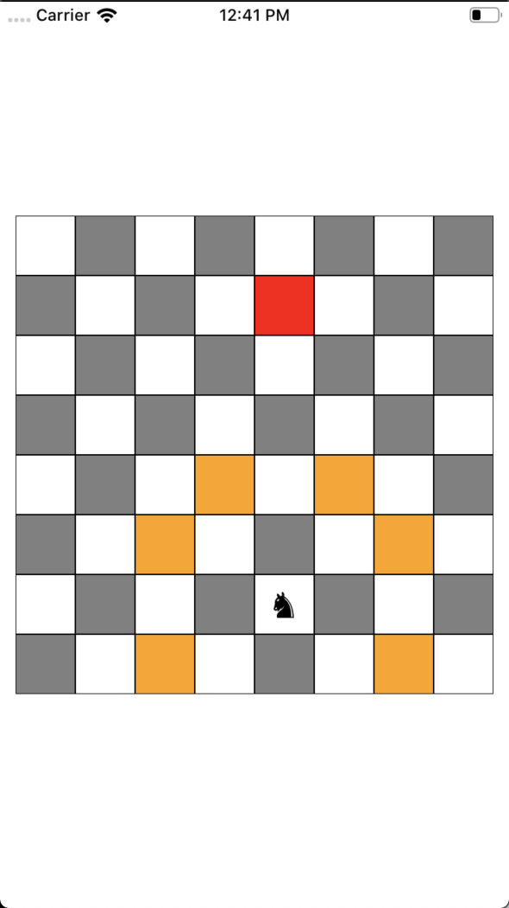
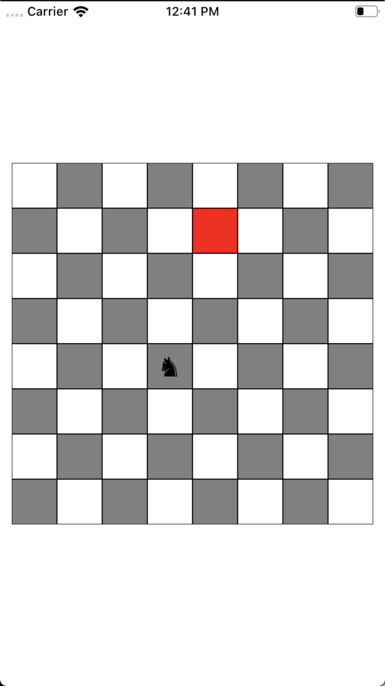
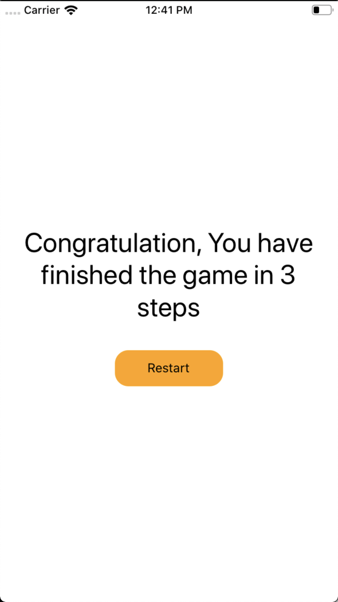

# Horse Jumping

> Time estimation: 150 minutes

## Release 0

Buatlah screen depan yang menyediakan tombol **START** atau **PLAY** yang jika ditap akan mengarahkan user ke screen berikutnya.

## Release 1

Buatlah screen yang berisi board papan catur.

Tentukan posisi random dimana pada posisi tersebut akan ditempatkan satu bidak knight (kuda).

Tentukan posisi random lainnya yang akan menjadi target tujuan perjalanan bidak kuda.

## Release 2

Setiap kuda ditap, akan menampilkan hint kemungkinan-kemungkinan posisi yang bisa ditempati kuda untuk gerakan berikutnya.

## Release 3

Jika posisi tadi diklik maka kuda akan berpindah ke posisi tersebut.

## Release 4

Jika kuda telah sampai ke posisi target tujuan, maka user akan diarahkan ke screen berikutnya.

## Release 5

Screen ini akan menampilkan berapa banyak step yang ditempuh mulai dari posisi awal hingga target.

Tersedia juga tombol **RESTART** atau **PLAY AGAIN** yang jika ditap akan mengarahkan user ke screen papan catur.

